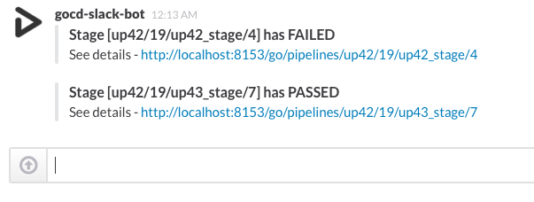

# gocd-slack-build-notifier
Slack based GoCD build notifier



## Setup
Download jar from releases & place it in /plugins/external & restart Go Server.

## Configuration
All configurations are in [HOCON](https://github.com/typesafehub/config) format. Create a file `go_notify.conf` in the server's home directory. Minimalistic configuration would be something like
```hocon
gocd.slack {
  server-host = "http://localhost:8153/"
  webhookUrl = "https://hooks.slack.com/services/...."

  # optional fields
  channel = "#build"
}
```
- `server-host` - FQDN of the Go Server. All links on the slack channel will be relative to this host.
- `webhookUrl` - Slack Webhook URL
- `channel` - Override the default channel where we should send the notifications in slack. You can also give a value starting with `@` to send it to any specific user.

## Pipline Rules
By default the plugin pushes a note about all failed stages across all pipelines to Slack. You have fine grain control over this operation.
```hocon
gocd.slack {
  server-host = "http://localhost:8153/"
  webhookUrl = "https://hooks.slack.com/services/...."

  pipelines = [{
    name = ".*"
    stage = ".*"
    state = "failed"
  },{
    name = "gocd-slack-build"
    stage = "build"
    state = "failed|passed"
    channel = "#oss-build-group"
  }]
}
```
`gocd.slack.pipelines` contains all the rules for the go-server. It is a list of rules (see below for what the parameters mean) for various pipelines.
- `name` - Regex to match the pipeline name
- `stage` - Regex to match the stage name
- `state` - State of the pipeline at which we should send a notification. You can provide multiple values separated by pipe (`|`) symbol
- `channel` - (Optional) channel where we should send the slack notification. This setting for a rule overrides the global setting

## License

http://www.apache.org/licenses/LICENSE-2.0
